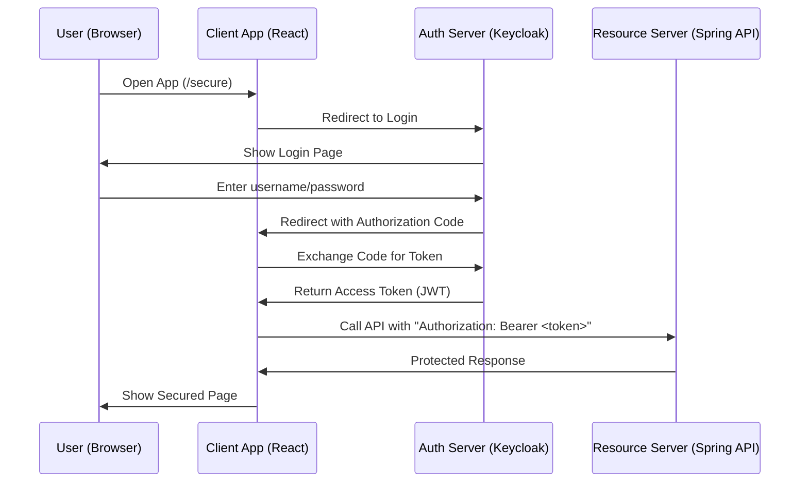
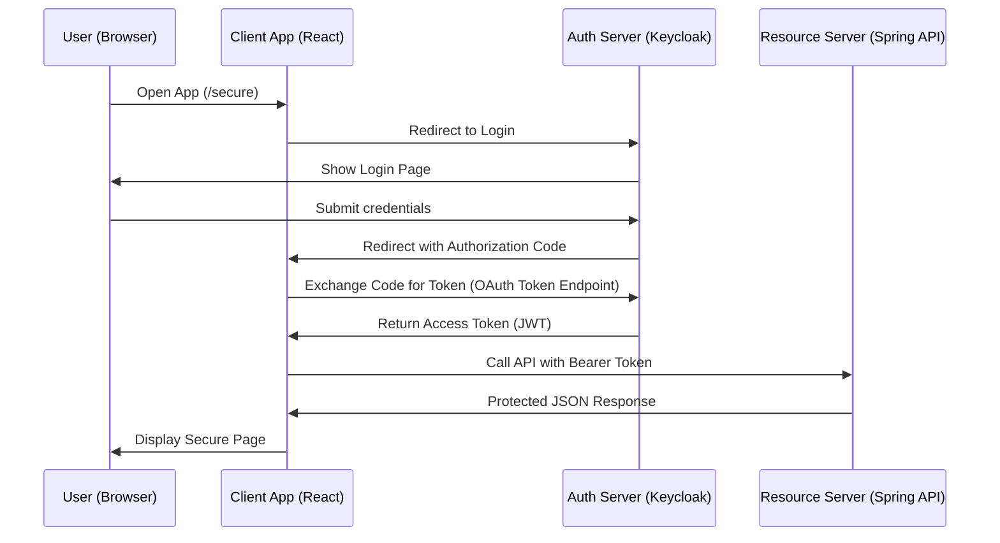

# 🛡️ What Is OAuth2

**OAuth2** is a secure way for apps to let users **log in** and **access APIs** *without passing usernames and passwords around.*

It separates the system into **three parts**:

1. **Authorization Server**

   * Example: **Keycloak**, Google Login, Facebook Login
   * Handles login, passwords, MFA
   * Issues **tokens** (like a secure badge)

2. **Client Application** (your app / frontend)

   * Example: **React app**
   * Sends the user to the login page
   * Receives a token afterward
   * Uses token to call backend API

3. **Resource Server**

   * Example: **Spring Boot API**
   * Holds the protected data
   * Checks the token
   * Allows or denies access based on roles/permissions

---

# 🧠 How OAuth2 Works

 **simplest flow** called **Authorization Code Flow** (the one used by browsers + SPAs).

### 1. User tries to access your app

### 2. Your app redirects them to the login server (Keycloak)

### 3. User logs in

### 4. Keycloak redirects back with an "authorization code"

### 5. Your app exchanges the code for a **token**

### 6. Your app calls the API using the **token**

### 7. API checks the token and returns data

---

# 🔐 ASCII Diagram — OAuth2 Flow

```
+----------------+         +-----------------+         +------------------+
|                |         |                 |         |                  |
|   User /       |  (1)    |   Client App    | (6)     |  Resource Server |
|  Browser App   +-------->+  (React, etc)   +-------->+ (Spring Boot API)|
|                |         |                 |         |                  |
+-------+--------+         +--------+--------+         +---------+--------+
        ^                           |                            ^
        |                           |                            |
        | (4) authorization code    | (7) API Response           |
        |                           |                            |
+-------+--------+         +--------v--------+                   
|                | (3)     |                 | (5)               
| Authorization  +-------->+   Keycloak      +-------------------+
|    Server      |         | (Login Server)  |   Tokens (JWT)    
|                |         |                 |                   
+----------------+         +-----------------+               
```




---

# 🔑 Key OAuth2 Concepts

### ✔️ **Access Token (JWT)**

* Like a **digital ID badge**
* Contains:

  * Username
  * Roles
  * Expiration time
* Sent to API in the header:

  ```
  Authorization: Bearer <token>
  ```

### ✔️ **Authorization Server**

* Handles login/password
* Issues access tokens
* Example: **Keycloak**

### ✔️ **Client**

* The app the user interacts with (React)
* Never stores passwords
* Only handles tokens

### ✔️ **Resource Server**

* API that returns protected data
* Validates JWT tokens
* Checks user roles with expressions like:

  ```
  @PreAuthorize("hasRole('ADMIN')")
  ```

### ✔️ **Scopes**

* Fine-grained permissions like:

  * `read`
  * `write`
  * `openid`
* Used mainly when third-party apps request permissions

### ✔️ **Redirect URI**

* Where Keycloak sends the user after login
* Must match exactly (including port)

### ✔️ **Authorization Code**

* A temporary code returned after login
* The client uses it to get the token

---

# 🔒 Why OAuth2 Is Safer Than Passing Passwords

* Passwords are **never sent to the app**
* Only Keycloak handles login
* The app only sees **tokens**
* Tokens expire → safer if stolen
* Roles are included inside the token → API doesn't need a database lookup

# 🔐 OAuth2 + Keycloak + Spring Boot + React

This project demonstrates a **complete end-to-end OAuth2 setup** using:

* **Keycloak** → Authorization Server (login + JWT tokens)
* **Spring Boot API** → Resource Server (secured endpoints)
* **React SPA** → OAuth2 Client (login + call API)

---

# 📦 Project Contents

This project contains three main pieces:

```
/keycloak      → (Configured externally)
/spring-api    → Spring Boot 3.5.x Resource Server (JWT)
/react-app     → React + keycloak-js client (Vite)
```

The ZIP includes:

* Java Spring API with:

  * SecurityConfig
  * HelloController (role-protected endpoints)
  * AuthController (force login)
  * CORS configuration

* React App with:

  * AuthContext
  * ProtectedRoute
  * keycloak.js
  * SecurePage
  * API service with Bearer token
  * Inactivity timer

---

# 🌈 Overview — What You Are Building

OAuth2 works by **separating login from your app**, so your app never handles passwords.

* 🔐 **Keycloak** handles login
* 🎨 **React App** requests tokens
* 🧠 **Spring Boot** checks tokens and roles
* 🔒 Roles decide access to certain endpoints

---

# 🛡️ OAuth2 Explained

OAuth2 is like using a **security badge** to access different rooms:

* Keycloak gives you the badge (token)
* React app carries the badge
* Spring Boot API checks the badge before letting you in

---

# 🧱 OAuth2 Roles in This Example

Keycloak realm roles you need to create:

* `USER`
* `ADMIN`
* `UPLOAD`

They map to Spring as:

```
ROLE_USER
ROLE_ADMIN
ROLE_UPLOAD
```

Spring endpoints:

| Endpoint           | Required Role |
| ------------------ | ------------- |
| `/api/hello`       | USER          |
| `/api/hello/admin` | ADMIN         |
| `/api/hello/user`  | UPLOAD        |

---

# 🧭 OAuth2 Authorization Code Flow (Step-by-Step)

1. User opens React app
2. React redirects to Keycloak login
3. User logs in
4. Keycloak redirects back with an authorization **code**
5. React + keycloak-js exchange that code for a **token (JWT)**
6. React calls Spring API with

   ```
   Authorization: Bearer <token>
   ```
7. Spring validates token + roles
8. Data is returned to the React app

---

# 🖼️ ASCII Diagram — OAuth2 Flow

```
+----------------+         +-----------------+         +------------------+
|                |         |                 |         |                  |
|   User /       |  (1)    |   Client App    | (6)     |  Resource Server |
|  Browser App   +-------->+  (React SPA)    +-------->+ (Spring Boot API)|
|                |         |                 |         |                  |
+-------+--------+         +--------+--------+         +---------+--------+
        ^                           |                            ^
        |                           |                            |
        | (4) authorization code    | (7) API Response           |
        |                           |                            |
+-------+--------+         +--------v--------+                   
|                | (3)     |                 | (5)               
| Authorization  +-------->+   Keycloak      +-------------------+
|    Server      |         | (Login Server)  |   Tokens (JWT)    
|                |         |                 |                   
+----------------+         +-----------------+               
```

---

# 🎨 Mermaid Diagram Version (Beautiful Markdown)



---

# ⚙️ Key Concepts (Bullet-Point Cheatsheet)

## 🔑 Access Token (JWT)

* Secure token with:

  * username
  * roles
  * expiration
* Sent to API:

  ```
  Authorization: Bearer <token>
  ```

## 🚪 Roles (Permissions)

* Assigned in Keycloak
* Example: USER / ADMIN / UPLOAD
* Checked in Spring Boot via:

  ```
  @PreAuthorize("hasRole('ADMIN')")
  ```

## 🔒 Resource Server (Spring Boot)

* Validates JWT signature
* Validates issuer (`demo-realm`)
* Maps roles from the token

## 🧠 Client (React)

* Uses `keycloak-js`
* Handles login redirects
* Stores token in memory (secure)
* Calls API using the token

## 🌍 CORS

Needed because:

* React = `http://localhost:5173`
* API = `http://localhost:8080`

Configured in Spring:

```
.allowedOrigins("http://localhost:5173")
.allowCredentials(true)
```

---

# 🚀 Setup Guide (Step-by-Step)

This section explains how to **run the whole project**, starting with Keycloak.

---

## 1️⃣ Start Keycloak (Login Server)

### Create Realm

* Name: **demo-realm**

### Create Roles

* `USER`
* `ADMIN`
* `UPLOAD`

### Create Test User

* username: `testuser`
* password: `password`
* assign roles (`USER` at minimum)

### Create Client

* Client ID: **demo-client**
* Valid redirect URIs:

  ```
  http://localhost:5173/*
  ```
* Web Origins:

  ```
  http://localhost:5173
  ```
* Enable **Standard Flow**

---

## 2️⃣ Start Spring Boot API

Requirements:

* Java 21
* Maven

Run:

```
cd spring-api
mvn spring-boot:run
```

API will run on:

```
http://localhost:8080
```

Endpoints:

* `/api/hello`
* `/api/hello/admin`
* `/api/hello/user`

Each requires different roles.

---

## 3️⃣ Start React App

Requirements:

* Node 18+
* Vite

Run:

```
cd react-app
npm install
npm run dev
```

App runs at:

```
http://localhost:5173
```

Navigate to `/login`.

---

# 🔥 Testing the Whole System

1. Open browser → `http://localhost:5173/secure`
2. You will be redirected to Keycloak
3. Login using your test user
4. React loads user info & roles
5. Click buttons to call secured endpoints
6. Spring responds based on your roles

---

# 🧪 Example API Calls

### Check “Hello” (requires role USER)

```
GET /api/hello
Authorization: Bearer <jwt>
```

### Check “Admin” (requires role ADMIN)

```
GET /api/hello/admin
Authorization: Bearer <jwt>
```

---

# 🔧 File Structure Example

```
spring-api/
  ├─ src/main/java/com/example/security/SecurityConfig.java
  ├─ src/main/java/com/example/controller/HelloController.java
  ├─ src/main/java/com/example/controller/AuthController.java
  ├─ src/main/resources/application.properties

react-app/
  ├─ src/AuthContext.jsx
  ├─ src/ProtectedRoute.jsx
  ├─ src/keycloak.js
  ├─ src/SecurePage.jsx
  ├─ src/apiService.js
  ├─ src/InactivityTimer.jsx
```

---

# 📘 Why Use OAuth2 (Instead of Sessions)

* No passwords sent through your apps
* Token is trusted and signed
* APIs don’t need to store sessions
* Roles included in token
* Works across multiple services

---

# 🎉 Conclusion

You now have a **complete OAuth2 ecosystem**:

| Component           | Purpose                        |
| ------------------- | ------------------------------ |
| **Keycloak**        | Authenticates + issues tokens  |
| **React Client**    | Logs in user + stores token    |
| **Spring Boot API** | Validates JWT + enforces roles |

This project is a solid foundation for:

* Microservices
* Role-based access
* Enterprise authentication
* Secure APIs
* Single Sign-On (SSO)

**explanation** of:

* **Man-in-the-Middle (MITM) attacks**
* **Session expiration**
* **Token refresh**
* **How OAuth2 + Keycloak + HTTPS protects you**
* **What you must configure to stay safe**

This version is beginner-friendly **and** technically correct — perfect for a README or training document.

---

# 🔐 1. Man-in-the-Middle (MITM) Attacks

## ❌ What is a MITM attack?

A **Man-in-the-Middle attack** happens when a hacker secretly intercepts communication between:

* The browser (React app)
* The Authorization Server (Keycloak)
* The Resource Server (Spring API)

The attacker tries to:

1. **Steal tokens**
2. **Modify requests**
3. **Pretend to be the user**

Example:

```
User → (attacker intercepts) → Keycloak
```

If the attacker can steal your JavaScript-accessible token, they can use it until it expires.

---

## ✔️ How OAuth2 prevents MITM

OAuth2 *by itself* does **not** stop MITM —
**HTTPS does**.

### 🔐 HTTPS (TLS/SSL) stops MITM

When you use:

```
https://my-api.com
https://my-login.com
```

Traffic is encrypted end-to-end.

Without HTTPS:

* Tokens can be stolen
* Passwords can be intercepted
* Redirect URL can be altered

### ✔ Keycloak + Spring Boot REQUIRE HTTPS in production

**Never deploy OAuth2 on plain HTTP.**

Configure:

* In React:

  ```js
  url: "https://auth.mycompany.com"
  ```

* In Keycloak:
  Settings → Realm → “Require HTTPS”

* In Spring Boot (`application.yml`):

  ```yaml
  server:
    ssl:
      enabled: true
  ```

---

## ✔ Additional MITM Protections

### 1. **PKCE (Proof Key for Code Exchange)**

You already enabled:

```js
pkceMethod: "S256"
```

PKCE prevents attackers from stealing authorization codes.

### 2. **Secure Cookies (if used)**

Set:

* `Secure`
* `SameSite=strict`
* `HttpOnly` (for non-SPA clients)

### 3. **CORS**

Prevents malicious websites from using your tokens:

```
allowedOrigins("https://my-frontend.com")
```

---

# ⏰ 2. Session Expiration

## ❌ What is session expiration?

A session expiration ensures:

* Users are logged out after inactivity
* Stolen tokens become useless
* MITM attackers can’t reuse old sessions

OAuth2 has 3 relevant expirations:

| Concept                      | Who controls it | Purpose                                   |
| ---------------------------- | --------------- | ----------------------------------------- |
| **Access Token Expiration**  | Keycloak        | Protect API access                        |
| **Refresh Token Expiration** | Keycloak        | Limit lifetime of auto-login              |
| **SSO Session Expiration**   | Keycloak        | Control how long the user stays logged in |

---

## ✔ How Your Example Handles Session Expiration

Your React example uses an **inactivity timer**:

```js
timeoutRef.current = setTimeout(() => {
  logout();
  alert("Session expired due to inactivity");
}, 5 * 60 * 1000);
```

This layer protects **client-side inactivity**.

But Keycloak also controls expiration:

### 🔑 Access Token lifetime

Default: **5 minutes**

After that, the API rejects requests:

```
401 Unauthorized – token expired
```

### 🔁 Refresh Token lifetime

Default: **30 minutes**

User stays logged in without re-entering password.

### 🧹 SSO session

Default: **10 hours**

User can stay logged in across browser tabs.

---

# 🔄 3. Token Refresh

## ✔ What is Token Refresh?

Your React SPA uses a **short-life access token** (JWT).

When it expires, the app uses the **refresh token** to get a new one.

Your code:

```js
await keycloak.updateToken(30)
```

Meaning:

> “If the token will expire in the next 30 seconds, refresh it now.”

If refresh succeeds → new access token returned
If refresh fails → login required

---

# 🔧 What Can Go Wrong With Token Refresh?

### ❌ 1. Attacker steals refresh token

If you store a refresh token in:

* LocalStorage
* SessionStorage
* IndexedDB

…an XSS attack can steal it.

**This is why refresh tokens in SPAs are dangerous.**

### ❌ 2. Infinite refresh (“zombie sessions”)

If refresh token expiration is too long:

* Users never log out
* Stolen tokens remain valid for hours or days

### ❌ 3. Using insecure HTTP

Refresh token can be intercepted ➜ attacker uses it to mint new tokens.

---

# ✔ How to Secure Token Refresh

### 1. Use HTTPS everywhere

This is **non-negotiable**.

### 2. Keep tokens in memory only

`keycloak-js` does this automatically.

Nothing is written to:

* LocalStorage
* SessionStorage
* Cookies

### 3. Set short access token lifetime

Recommended:

```
Access Token Lifetime: 5 minutes
```

### 4. Set short refresh token lifetime

Recommended:

```
Refresh Token Max: 30 minutes
No Reuse: Enabled
```

### 5. Use PKCE (enabled in your SPA)

Prevents stolen authorization codes from being reused.

---

# 🛡 How OAuth2 + Keycloak + Spring Protect You

| Attack                     | How It’s Stopped             |
| -------------------------- | ---------------------------- |
| MITM                       | HTTPS + PKCE                 |
| Stolen token               | Short token expiration       |
| Replay attack              | Nonce + signed JWT           |
| Attacker refreshes forever | Short refresh lifetime       |
| Cross-site token use       | CORS + SameSite cookies      |
| XSS stealing token         | Tokens stored only in memory |

---

# 📦 Summary Table

| Security Feature  | React SPA        | Keycloak     | Spring API   |
| ----------------- | ---------------- | ------------ | ------------ |
| HTTPS             | Required         | Required     | Required     |
| PKCE              | Enabled          | Supported    | N/A          |
| Access Token Exp  | Reads            | Configurable | Enforced     |
| Refresh Token Exp | Reads            | Configurable | N/A          |
| Session Timeout   | Inactivity timer | SSO settings | N/A          |
| Token Storage     | Memory only      | Secure JWT   | Header-based |

---

# ✔ Final Summary 

### **Man in the Middle**

* Attack: Someone intercepts your traffic
* Fix: **Always use HTTPS + PKCE**

### **Session Expiration**

* Purpose: Kick users out if inactive to protect stolen sessions
* Fix: Keycloak SSO session limits + React inactivity timer

### **Token Refresh**

* Purpose: Keep user logged in without entering password
* Danger: If refresh token is stolen
* Fix: Short refresh token lifetime + HTTPS + memory storage

---

# 🔐 OAuth2 + Keycloak + Spring Boot + React

## End-to-End Secure Authentication & Authorization Tutorial

This repository demonstrates a **fully functional OAuth2 system** using:

* **Keycloak** → Identity Provider (SSO, OAuth2, OpenID Connect)
* **Spring Boot 3.5.x** → OAuth2 Resource Server (JWT validation + RBAC)
* **React + Vite** → OAuth2 Client (keycloak-js, PKCE, token refresh, inactivity logout)

This tutorial includes:

* OAuth2 authorization code flow
* PKCE
* CORS
* Role-based access control
* MITM protection
* Token refresh & rotation
* Session expiration (Keycloak + React inactivity timer)
* API security
* Developer security checklist

---

# 🧠 What You Will Learn

✔ How OAuth2 works
✔ How to configure Keycloak properly
✔ How to secure a Spring Boot API with JWT roles
✔ How to secure a React SPA with keycloak-js
✔ Common security pitfalls and how to avoid them
✔ How to identify risks (MITM, token theft, replay, CSRF)
✔ How to deploy securely

---

# 🖼 Architecture

```
   ┌───────────────┐          ┌──────────────────┐          ┌────────────────┐
   │     User       │          │    React SPA     │          │ Spring Boot API│
   │ (Browser/App)  │          │   (Client App)   │          │ (ResourceServer)│
   └───────┬────────┘          └─────────┬────────┘          └─────────┬────────┘
           │ 1. Open /secure route         │                           │
           │──────────────────────────────>│                           │
           │                                │ 2. Redirect to login     │
           │                                │──────────────────────────>│
           │                                │                           │
   ┌───────▼────────┐                      │                           │
   │   Keycloak     │ <────────────────────┘                           │
   │ (Auth Server)  │ 3. User Login Success                            │
   └───────┬────────┘                                                  │
           │ 4. Auth Code                                              │
           │──────────────────────────────────────────────────────────>│
           │                                │                           │
           │                                │ 5. Exchange for JWT       │
           │                                │──────────────────────────>│
           │                                │                           │
           │                                │ 6. API call + Bearer JWT  │
           │                                │───────────────────────────>|
```

---

# 🔐 Role Mapping in This Example

| Keycloak Role | Spring Security | Endpoint           |
| ------------- | --------------- | ------------------ |
| USER          | ROLE_USER       | `/api/hello`       |
| ADMIN         | ROLE_ADMIN      | `/api/hello/admin` |
| UPLOAD        | ROLE_UPLOAD     | `/api/hello/user`  |

---

# ⚙️ Setup Instructions

## 1. Start Keycloak

### Create Realm

`demo-realm`

### Create Roles

`USER`, `ADMIN`, `UPLOAD`

### Create User

Assign at least the `USER` role

### Create Client

* Client ID: **demo-client**
* Standard Flow: **Enabled**
* PKCE: **Enabled**
* Redirect URIs:

  ```
  http://localhost:5173/*
  ```
* Web Origins:

  ```
  http://localhost:5173
  ```

---

## 2. Start Spring Boot API

```
cd spring-api
mvn spring-boot:run
```

Runs at:
`http://localhost:8080`

---

## 3. Start React App

```
cd react-app
npm install
npm run dev
```

Runs at:
`http://localhost:5173`

---

# 🔥 Testing

1. Visit → `/secure`
2. Get redirected to Keycloak
3. Login
4. View roles + claims
5. Click buttons to call protected endpoints
6. View JSON responses
7. Token refresh occurs automatically
8. Inactivity timer logs you out after 5 minutes

---

# 🔒 Security Concepts 

## ✔ Man-in-the-Middle (MITM)

Attackers intercept traffic.

**Fix:**

* HTTPS everywhere
* PKCE
* CORS restrictions
* Reject non-TLS HTTP

---

## ✔ Session Expiration

Prevents attackers using old sessions.

**Fix:**

* Short access tokens (5–15 min)
* Short refresh tokens (30–60 min)
* React inactivity logout
* Keycloak SSO idle timeout

---

## ✔ Token Refresh

Keeps users logged in securely.

**Fix:**

* Store tokens **in memory only**
* Use PKCE
* Use HTTPS
* Use short refresh token lifespan
* Enable refresh token rotation

---

# 📋 Complete Security Checklist

### 🔐 HTTPS Requirement

* [ ] Keycloak HTTPS enabled
* [ ] Spring Boot API served over HTTPS
* [ ] React served over HTTPS
* [ ] HTTP-to-HTTPS redirect enforced

### 🔑 Token Security

* [ ] Access tokens expire within 5–10 minutes
* [ ] Refresh tokens expire within 30–60 minutes
* [ ] Token rotation enabled
* [ ] Tokens stored only in memory (NEVER localStorage)
* [ ] JWT signature validation enabled
* [ ] JWT issuer validated
* [ ] JWT audience validated

### 🔒 CORS + Browser Security

* [ ] CORS restricted to official domains
* [ ] CSP header configured
* [ ] X-Frame-Options configured
* [ ] Cookies set to:

  * [ ] Secure
  * [ ] HttpOnly (if used)
  * [ ] SameSite=strict

### 🔏 API Security

* [ ] `@PreAuthorize` or `@RolesAllowed` on protected endpoints
* [ ] No public endpoint leaks security context
* [ ] Rate limiting enabled
* [ ] Error messages do NOT leak internals

### 👤 Session Security

* [ ] React inactivity logout
* [ ] Keycloak SSO idle timeout set
* [ ] Keycloak SSO max lifespan set
* [ ] Refresh token reuse prevention enabled

### 🧱 Infrastructure Hardening

* [ ] Disable default Keycloak admin account
* [ ] Use external DB with access control
* [ ] Enable Keycloak audit logs
* [ ] Enable API audit logs
* [ ] Rotate Keycloak signing keys periodically

---

# 📘 **2. SECURITY AUDIT CHECKLIST **

*A complete audit-ready checklist you can use for compliance, engineering reviews, or penetration test preparation.*

---

## 🔐 1. Authentication Security

| Item                                          | Status | Notes             |
| --------------------------------------------- | ------ | ----------------- |
| OAuth2 Authorization Code Flow with PKCE      | ☐      | Required for SPAs |
| HTTPS enabled end-to-end                      | ☐      | Prevent MITM      |
| Keycloak login dialogs only served over HTTPS | ☐      |                   |
| No password handling in React                 | ☐      | Correct usage     |

---

## 🔏 2. Token Security

| Item                                    | Status |
| --------------------------------------- | ------ |
| Access Tokens < 10 min lifetime         | ☐      |
| Refresh Tokens < 30–60 min lifetime     | ☐      |
| Refresh token reuse detection           | ☐      |
| Token stored in memory                  | ☐      |
| No token in localStorage/sessionStorage | ☐      |
| No token in cookies (unless HttpOnly)   | ☐      |

---

## 🔒 3. API Security (Spring Boot)

| Item                                     | Status |
| ---------------------------------------- | ------ |
| Resource Server JWT validation enabled   | ☐      |
| Validates issuer (`iss`)                 | ☐      |
| Validates audience (`aud`)               | ☐      |
| Role mapping configured                  | ☐      |
| `@PreAuthorize` on all restricted routes | ☐      |
| Error messages sanitized                 | ☐      |

---

## 🌐 4. Browser + Frontend Security

| Item                                                   | Status |
| ------------------------------------------------------ | ------ |
| Correct CORS configuration                             | ☐      |
| CSP configured                                         | ☐      |
| X-Frame-Options set                                    | ☐      |
| Tokens never exposed to JavaScript outside keycloak-js | ☐      |

---

## 🛡 5. Session & Inactivity

| Item                                  | Status |
| ------------------------------------- | ------ |
| SPA inactivity logout enabled         | ☐      |
| Keycloak SSO idle timeout set         | ☐      |
| Keycloak SSO max session lifespan set | ☐      |

---

## 🧱 6. Keycloak Server Hardening

| Item                                  | Status |
| ------------------------------------- | ------ |
| Admin console access restricted by IP | ☐      |
| Admin accounts 2FA enabled            | ☐      |
| Logging & audit trails enabled        | ☐      |
| Brute force detection enabled         | ☐      |
| Regular signing key rotation          | ☐      |

---

## 🗄 7. Infrastructure

| Item                                     | Status |
| ---------------------------------------- | ------ |
| Environment variables protected          | ☐      |
| Docker images scanned                    | ☐      |
| API behind reverse proxy (Nginx/Traefik) | ☐      |
| Rate limiting enabled                    | ☐      |

---

# 🚀 Developer Onboarding Guide

### Welcome to the OAuth2 / Keycloak / Spring / React Security Stack

This guide will walk you through:

* How login works
* Where the code lives
* How to start all services
* How to debug tokens
* How to verify roles
* How to ensure you don’t break security

---

## 🧩 System Overview

### Your job as a developer is to understand:

| Component       | Purpose                           | Location      |
| --------------- | --------------------------------- | ------------- |
| Keycloak        | Authentication, roles, login, JWT | Docker / URL  |
| React SPA       | User interface + OAuth2 client    | `/react-app`  |
| Spring Boot API | Protected backend                 | `/spring-api` |

---

## 🛠 Step 1 — Start All Services

### Keycloak

Use your team’s command or Docker Compose.

### Spring Boot API

```
cd spring-api
mvn spring-boot:run
```

### React Application

```
cd react-app
npm install
npm run dev
```

---

## 🔐 Step 2 — Login Flow

1. Navigate to:
   `http://localhost:5173/secure`
2. React → Keycloak login page
3. Keycloak authenticates
4. React receives JWT
5. React calls Spring API with:

   ```
   Authorization: Bearer <token>
   ```

---

## 🔍 Step 3 — Viewing Your Token

Open browser DevTools → Application → keycloak-js managed data.

Your decoded JWT will contain:

* `preferred_username`
* `realm_access.roles`
* `exp` (expires—important)
* `iat` (issued at)

---

## 👮 Step 4 — Role-based APIs

### USER required

`/api/hello`

### ADMIN required

`/api/hello/admin`

### UPLOAD required

`/api/hello/user`

Roles come from Keycloak → Included in JWT → Mapped in Spring.

---

## ⚠ Security Rules for Developers

### 1. Never handle passwords

React must NEVER process passwords.
Keycloak handles all authentication forms.

### 2. Never store tokens in:

* localStorage ❌
* sessionStorage ❌
* cookies ❌ (unless HttpOnly)

Use **memory storage only** (keycloak-js default).

### 3. Always use HTTPS in production

Do NOT test authentication over HTTP.

### 4. Never bypass role checks

Every sensitive endpoint must use:

```java
@PreAuthorize("hasRole('ADMIN')")
```

### 5. Don’t disable CORS protections

Frontend domains must be explicit.

---

